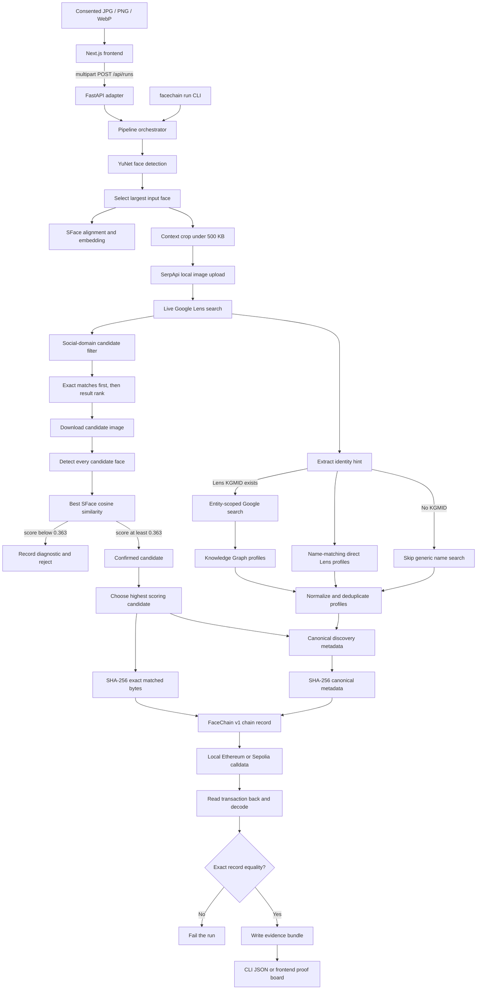

# FaceChain Evidence Architecture

## Live frontend transport

The frontend calls the original `POST /api/runs` endpoint with `Accept: text/event-stream`. The
pipeline emits measured events around its real operations and includes actual search crops,
candidate images, match scores, profile evidence, hashes, and receipts. Ordinary callers that do
not request SSE continue to receive the original JSON summary. The visual stage indicator is fully
backend-driven.

## 1. Purpose

FaceChain accepts a consented face image, finds visually related social content through a genuine
Google Lens search, independently confirms the face match locally, resolves only defensible social
profile associations, and anchors a compact evidence fingerprint in an Ethereum transaction.

The system is designed around two different questions:

1. **Does a discovered image contain the same face?** OpenCV SFace answers this locally.
2. **Which social accounts can safely be associated with that person?** Google Lens and, when
   available, a Google Knowledge Graph entity answer this from explicit search evidence.

These checks are intentionally separate. A matching face in a post does not prove that every
same-name social account belongs to that person.

## 2. End-to-end flow



The HTTP request is synchronous: the API returns only after searching, matching, publishing, and
reading the transaction back. The frontend's five-stage indicator is a presentation timer; it does
not receive individual server-side progress events.

## 3. Entry points

### Web interface

The frontend lives in `frontend/` and performs four client-side checks before submission:

- accepts only JPEG, PNG, or WebP;
- rejects files larger than 15 MB;
- requires the user to confirm consent;
- requires a chain target: local Ethereum or Sepolia.

It checks `GET /api/health`, sends the image and chain as multipart form data to
`POST /api/runs`, and renders the returned match, profiles, content hash, transaction receipt, and
evidence path.

### FastAPI adapter

`src/facechain/api.py` is deliberately thin. It validates media type, size, and chain selection,
writes the upload to a temporary file, and calls the blocking pipeline in a thread pool. The
temporary upload is deleted in a `finally` block on both success and failure. CORS origins come
from `FACECHAIN_ALLOWED_ORIGINS` and default to `http://localhost:3000`.

The API returns a compact UI-facing view of the evidence. The complete record remains in the local
artifact directory.

### CLI

`src/facechain/cli.py` exposes the same core pipeline without duplicating it:

- `facechain download-models` downloads and checksum-verifies the ONNX models;
- `facechain inspect-face IMAGE` validates local detection without a web search;
- `facechain run IMAGE` executes the full pipeline;
- `facechain verify EVIDENCE` independently verifies a persistent Sepolia bundle;
- `facechain serve` starts the FastAPI adapter.

## 4. Face preparation and local biometric processing

`FaceEngine` in `src/facechain/face.py` uses two pinned OpenCV Zoo models:

- **YuNet 2026may** detects faces and facial landmarks;
- **SFace 2021dec** aligns faces, produces embeddings, and computes cosine similarity.

The model files are checked against hard-coded SHA-256 values every time they are resolved. A
missing or modified model stops the run.

For the input image, YuNet may detect multiple faces. FaceChain selects the largest bounding box as
the primary subject, aligns it, and computes its SFace feature vector. The vector exists only in
process memory and is never written to an artifact or transaction.

The reverse-search image is not the entire original. The pipeline crops the primary face with 35%
context on each side, limits the largest dimension to 1200 pixels, and progressively reduces JPEG
quality until the upload is at most 500 KB. This preserves useful context while meeting the search
upload constraint.

## 5. Genuine Google Lens discovery

`SerpApiLens.search` performs two live operations:

1. uploads the generated crop to SerpApi and receives an `image_id`;
2. calls the SerpApi `google_lens` engine with that ID, English results, and SafeSearch enabled.

No result URL or identity is hard-coded. `SERPAPI_KEY` is mandatory.

Candidate extraction reads Lens `visual_matches` and `exact_matches`, keeps only supported social
hostnames, and deduplicates by source URL. Hostname boundary checks prevent lookalike domains such
as `x.com.attacker.example` from being accepted. Candidates are ordered with exact visual matches
first and Lens rank second; at most 20 are evaluated by default.

Supported sources currently include Facebook, GitHub, Instagram, LinkedIn, Medium, Pinterest,
Reddit, Threads, TikTok, X/Twitter, YouTube, and Bluesky.

The stored `search-response.json` is sanitized: API parameters and private result endpoints are
removed while useful search identifiers, timing, status, and result evidence are retained.

## 6. Independent candidate face confirmation

Lens is used for discovery, not as the final face verifier. For each ranked candidate, FaceChain:

1. downloads the full result image, falling back to the thumbnail if necessary;
2. requires an image content type and enforces a 15 MB download limit;
3. runs YuNet over every face in that candidate image;
4. aligns and encodes every detected face with SFace;
5. compares each feature to the input feature and keeps the highest cosine score.

The default SFace acceptance threshold is `0.363`, OpenCV's published LFW cosine baseline. Scores
below the threshold, images with no face, blocked CDN downloads, and invalid media are recorded in
`candidate-diagnostics.json` instead of silently disappearing.

If no candidate passes, the run stops with `NoMatchError`. If several pass, the highest-scoring
candidate becomes the final matched content. The exact downloaded bytes are saved as
`matched-content.*`; those exact bytes, rather than a re-encoded copy, are hashed later.

A cosine score is evidence of visual similarity, not legal proof of identity. Thresholds can
produce both false positives and false negatives.

## 7. Identity and social-profile resolution

Profile resolution runs from the Lens evidence independently of candidate face comparison.

### Preferred path: Lens entity plus Knowledge Graph

If Lens `related_content` supplies a query and `kgmid`, FaceChain treats that pair as an entity hint
and performs an entity-scoped Google search using both the name and KGMID. It extracts profile URLs
listed in the Knowledge Graph and labels them `knowledge_graph`.

This explains why one image can go through Knowledge Graph while another does not: Google Lens may
return a recognized entity/KGMID for the first image but only ordinary visual matches for the
second. FaceChain cannot manufacture a Knowledge Graph entity when Google does not return one.

### Safe fallback: visual consensus

When Lens supplies no entity, FaceChain may infer a display name only if at least two of the first
ten high-confidence result titles independently produce the same plausible name. Name extraction
is intentionally narrow and currently recognizes structured GitHub, LinkedIn profile, and
portfolio title patterns.

Without a KGMID, the pipeline **does not perform a generic name search**. A name-only query was the
source of plausible-looking but incorrect Instagram, X, and Facebook accounts: search relevance
does not establish account ownership, especially for shared names.

In the no-KGMID path, FaceChain retains only direct Lens result URLs whose structured title yields
the exact consensus name. This is why correctly linked GitHub and LinkedIn profiles can remain
while unsupported accounts are removed.

### Profile URL safety and confidence

Every profile candidate is normalized and checked before output:

- the host must be in the supported social allowlist;
- post, reel, video, search, feed, and status URLs are rejected as profiles;
- platform-specific handles are extracted from valid profile routes;
- duplicates are removed by normalized platform and handle.

The evidence records where each profile came from:

| Confidence value | Meaning |
| --- | --- |
| `knowledge_graph` | Explicitly listed for the entity in Google's Knowledge Graph. |
| `lens_result` | A direct Lens profile result whose parsed name exactly matches Lens identity evidence. |
| `search_result` | A profile-shaped organic result from an entity-scoped KGMID search; useful but weaker. |

These labels express provenance, not a guarantee that the person still controls the account.

## 8. Evidence construction

After selecting the best confirmed result, FaceChain creates two independent hashes.

### Content hash

`content_sha256` is SHA-256 over the exact downloaded `matched-content.*` bytes. Any byte-level
change, including recompression or resizing, produces a different hash.

### Metadata hash

The complete discovery metadata includes:

- schema and provider search ID;
- source URL, platform, title, image URL, observation time, and result rank;
- whether Lens marked the result as an exact visual match;
- detector, encoder, cosine score, threshold, and number of candidate faces;
- resolved identity and provenance-labelled social profiles.

This object is serialized as deterministic canonical JSON: UTF-8, keys sorted, no insignificant
whitespace, and no NaN values. SHA-256 of those bytes becomes `metadata_sha256`. Canonicalization
means the same logical metadata produces the same hash regardless of Python dictionary order.

### On-chain record

Only this compact `facechain.evidence.v1` record is placed in transaction calldata:

```json
{
  "schema": "facechain.evidence.v1",
  "content_sha256": "0x…",
  "source_url": "https://…",
  "observed_at": "2026-…Z",
  "metadata_sha256": "0x…"
}
```

The calldata starts with the binary prefix `FACECHAIN:v1:` followed by canonical JSON. The matched
image, face embedding, search response, and full metadata are not written on-chain.

## 9. Ethereum publication and verification

`EthereumEvidenceChain` supports two backends with the same record format.

### Local Ethereum

The default uses Web3.py's `EthereumTesterProvider`. It sends a zero-value self-transaction from a
pre-funded test account, mines immediately, reads the transaction back, and verifies it within the
same process. This proves the encoding and verification flow without requiring a wallet or gas,
but the chain disappears when the process ends.

### Sepolia

Sepolia uses `SEPOLIA_RPC_URL` and a dedicated testnet `SEPOLIA_PRIVATE_KEY`. FaceChain builds and
signs an EIP-1559 zero-value self-transaction locally, waits for its receipt, and returns a public
Etherscan URL. Sepolia provides a persistent record that can be independently checked later.

### Immediate read-back

A mined receipt alone is insufficient. The pipeline fetches the transaction by hash, decodes its
input, validates the FaceChain prefix/schema, and requires exact dictionary equality with the
record it intended to publish. A mismatch fails the run before `verified` is returned.

For later Sepolia verification, `facechain verify` performs three checks:

1. re-hash the local matched image and compare it with on-chain `content_sha256`;
2. canonicalize and re-hash the bundle metadata and compare `metadata_sha256`;
3. fetch and compare the actual Sepolia transaction record.

The final result is verified only when all three checks pass.

## 10. Artifact layout

Every run creates `artifacts/<UTC timestamp>-<random suffix>/` containing:

| Artifact | Purpose |
| --- | --- |
| `evidence.json` | Full run bundle, hashes, metadata, receipt, privacy declaration, and verification result. |
| `matched-content.*` | Exact off-chain bytes selected and hashed by the pipeline. |
| `search-response.json` | Sanitized Google Lens evidence. |
| `profile-search-response.json` | Sanitized Knowledge Graph/entity evidence or the reason it was safely skipped. |
| `candidate-diagnostics.json` | Rejected candidate URLs, errors, and below-threshold scores. |

The original API upload is temporary and deleted. Artifacts and local demo images are ignored by
Git because they may contain biometric or personal data.

## 11. Failure behavior

The pipeline fails closed at important trust boundaries:

- missing API key or checksum-invalid models stop before search;
- an unsupported/empty/oversized upload is rejected by the API;
- no detectable input face stops before network search;
- no supported Lens results or no SFace-confirmed result prevents publication;
- candidate download and face-detection failures are logged and skipped;
- profile discovery failure does not invent profiles; the match can continue with an empty list;
- missing KGMID disables ambiguous generic social search;
- a reverted transaction, RPC error, invalid calldata, or read-back mismatch prevents verification.

## 12. Deployment boundary

The Next.js/vinext frontend can be deployed independently as a static/server-rendered interface.
The Python API performs OpenCV inference, SerpApi calls, artifact writes, and Ethereum operations,
so a deployed frontend needs `NEXT_PUBLIC_FACECHAIN_API_URL` set to a separately hosted HTTPS API.
The API must allow the frontend origin through `FACECHAIN_ALLOWED_ORIGINS`.

For local development, the standard topology is:

```text
Browser :3000  ->  FastAPI :8000  ->  OpenCV models
                                  ->  SerpApi / Google Lens
                                  ->  local eth-tester or Sepolia RPC
                                  ->  artifacts/<run-id>/
```

## 13. Main implementation map

| Concern | File |
| --- | --- |
| Frontend workflow and proof board | `frontend/app/page.tsx` |
| HTTP validation and pipeline adapter | `src/facechain/api.py` |
| End-to-end orchestration and artifacts | `src/facechain/pipeline.py` |
| Face detection, encoding, crop, and comparison | `src/facechain/face.py` |
| SerpApi Lens discovery and safe profile resolution | `src/facechain/search.py` |
| Deterministic hashing and record encoding | `src/facechain/canonical.py` |
| Ethereum publish, read, and verification | `src/facechain/chain.py` |
| Model download and checksum pinning | `src/facechain/model_store.py` |
| CLI entry points | `src/facechain/cli.py` |
| Shared result models | `src/facechain/models.py` |
